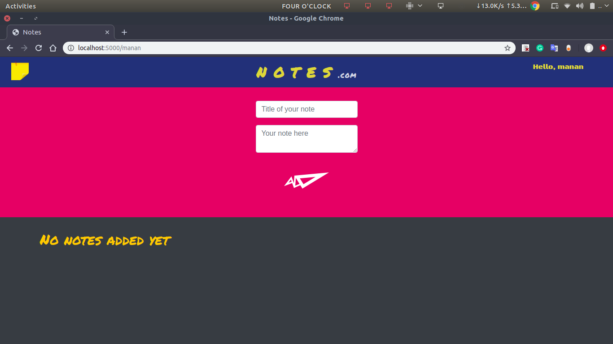
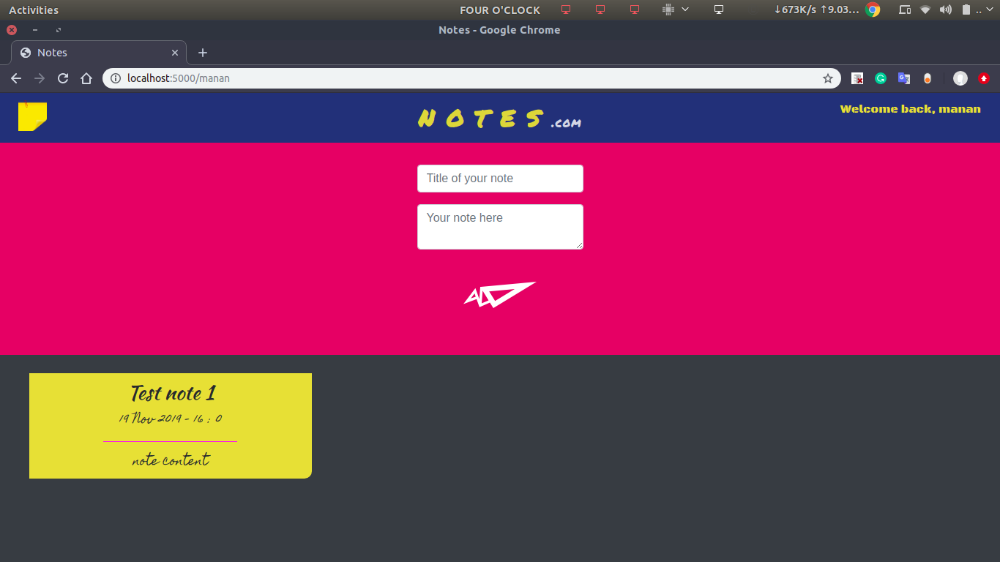
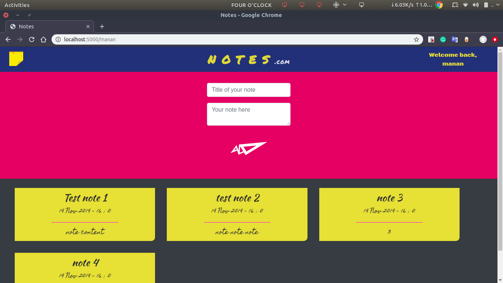

# Notes
A dynamic website created using Flask, HTML and CSS (along with Bootstrap) where you can jot down post-it style notes.  
**NOTE**: You can visit /your_name to customize the website with your name, you can also visit /any_other_name to go to a different page where you can write new notes. Notes written at /name are saved for the given server session.

## Running the website
To run the webiste, navigate to the /notes directory and run:
```
python3 server.py
```
Then, navigate to the website, try going to your name by typing the following in the URL bar:
```
localhost:5000/your_name_here
```
## Screens
   

## License
This project is licensed under the [MIT](https://opensource.org/licenses/MIT) License
